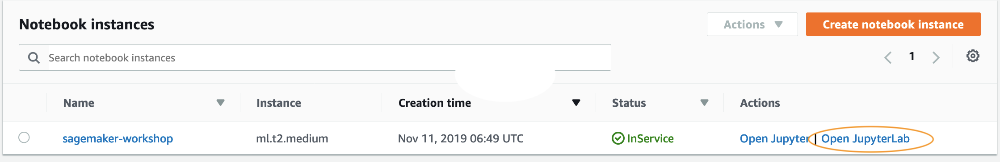
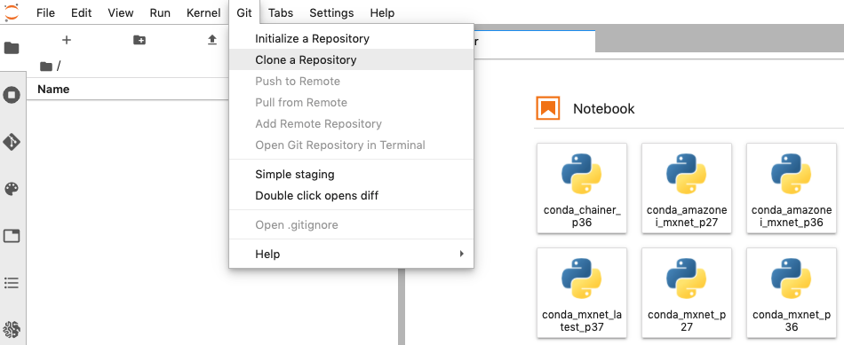
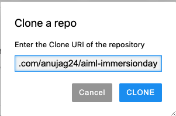
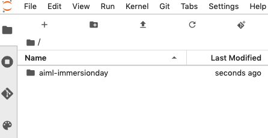
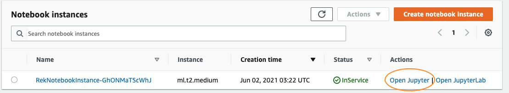
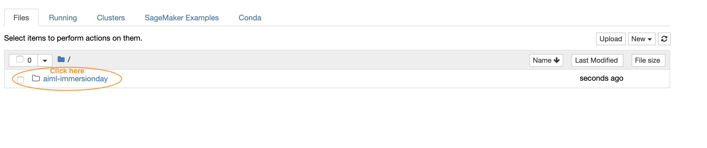
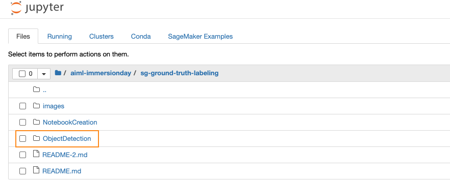
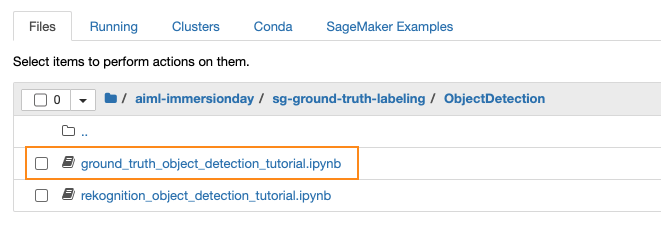

# Amazon SageMaker Ground Truth and Amazon Rekognition Custom Labels

1. From the [Rekognition Immersion day Pre-requisite](https://rekognition-immersionday.workshop.aws/rek_apis.html) launch the Cloudformation stack in the "Launch Amazon SageMaker Notebook Instance" section. 

**Note:** You don't need to do the "Download necessary notebooks" section on that page. 

2. Next we will Create a s3 bucket. 

As you create a model training job, you will save the following in an Amazon S3 bucket:
- The model training data
- Model artifacts, which Amazon SageMaker generates during model training

You can store the training data and artifacts in a single bucket or in two separate buckets. For exercises in this guide, one bucket is sufficient. You can use existing buckets or create new ones.

Follow the instructions in [Create a Bucket](https://docs.aws.amazon.com/AmazonS3/latest/userguide/create-bucket-overview.html) in the Amazon Simple Storage Service Console User Guide. Include sagemaker in the bucket name; for example, sagemaker-datetime.

3. Click on "Open JupyterLab"

4. Select Git > Clone Repository

5. Enter git url "https://github.com/anujag24/aiml-immersionday" in the dialog box and click "Clone"

6. After cloning is complete, verify that directory named "aiml-immersionday" is created

7. Click on 'Open Jupyter' 

8. Click "aiml-immersionday" to open the folder

9. Click "sg-ground-truth-labeling" to open the folder

10. Click "ObjectDetection" to open the folder

11. Click on **'ground_truth_object_detection_tutorial.ipynb'** to open the notebook in the browser

12. Open the ground_truth_object_detection_turtorial.ipynb and follow the instructions in the Notebook.

